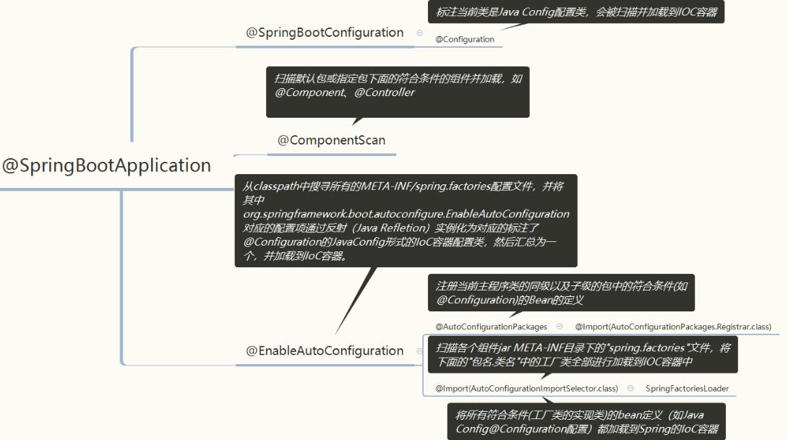

## SpringBoot学习

### 注解原理
#### 元注解
  - @Retention
  ```
     @Retention(RetentionPolicy.SOURCE) //注解仅存在源码中,在class字节码文件中不包含,对应Java源文件
     @Retention(RetentionPolicy.CLASS)  //默认的保留策略,注解会在class字节码文件中存在,但运行时无法获得 .Class
     @Retention(RetentionPolicy.RUNTIME)// 注解会在class字节码文件中存在，在运行时可以通过反射获取到, 对应内存中的字节码
  ```
  - @Target
  ```
    @Target(ElementType.ANNOTATION_TYPE)
    public @interface Target {
    ElementType[] value();
    }
    
    @Target(ElementType.TYPE)   //接口、类、枚举、注解
    @Target(ElementType.FIELD) //字段、枚举的常量
    @Target(ElementType.METHOD) //方法
    @Target(ElementType.PARAMETER) //方法参数
    @Target(ElementType.CONSTRUCTOR)  //构造函数
    @Target(ElementType.LOCAL_VARIABLE)//局部变量
    @Target(ElementType.ANNOTATION_TYPE)//注解
    @Target(ElementType.PACKAGE) //包
  ```
  - @Document:说明该注解将被包含着javadoc中
  ```
  @Documented
  @Retention(RetentionPolicy.RUNTIME)
  @Target(ElementType.ANNOTATION_TYPE)
  public @interface Documented {
  }
  ```
  - @Inherited:说明子类能够继父类的该注解,就是当一个类A使用了改注解,
               一个类B继承这个类A,则类B也拥有类A的所有注解
  ```
  @Documented
  @Retention(RetentionPolicy.RUNTIME)
  @Target(ElementType.ANNOTATION_TYPE)
  public @interface Documented {
  }
  ```
#### 组合注解
  - 自定义注解
  ```
  @Target(ElementType.METHOD)//元注解
  @Retention(RetentionPolicy.RUNTIME)//元注解
  public @interface MyAnnotation {
      //定义注解的属性，这不是方法
      // 语法：类型 属性名() default 默认值;
       
      String name();//必选注解
      String src();
      String age() default "22";
      int value() default 20;//有属性就是可选属性
  }
  ```
  - 创建一个类,在类上使用该注解
  ```
  public class UseMyAnnotion {
   
      // 这里只用一个属性，另一个value属性有默认值不用设置
      @MyAnnotation(name = "wenShao", src = "我的注解")
      public void show(String str){
          System.out.println(str);
      }
  }
  ```
  - 解析注解,利用反射原理
  ```
  public class MyAnnotationParser {
      public static void main(String[] args) throws NoSuchMethodException, InvocationTargetException, IllegalAccessException {
   
          //获取字节码对象
          Class<UseMyAnnotion> clazz = UseMyAnnotion.class;
          //获取对象的方法
          Method showmethod = clazz.getMethod("show", String.class);
          //获取方法上的注解
          MyAnnotation annotation = showmethod.getAnnotation(MyAnnotation.class);
          System.out.println(annotation.name()+"\t"+annotation.value()+"\t"+annotation.src());
   
          //取到值就可以根据业务处理数据
          //激活方法。也就是让方法执行
          showmethod.invoke(new UseMyAnnotion(),"HH");
   
      }
  }
  ```
### 启动流程




### 自动配置
1. SpringFactoriesLoader

### [参考资料](https://www.cnblogs.com/theRhyme/p/11057233.html)